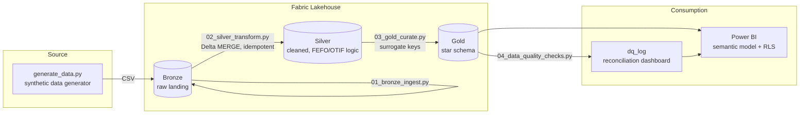

# Supply Chain Control Tower

[](https://github.com/KushPatel29/supply-chain-control-tower-/actions/workflows/ci.yml)


A Microsoft Fabric + Power BI analytics platform for a synthetic perishable-goods
distributor — inventory turns, days-on-hand, OTIF/fill rate, and FEFO/expiry risk,
built on a governed Lakehouse medallion architecture with row-level security.
Every push regenerates the data, executes the full medallion pipeline through
a **data-quality gate that provably halts the publish on critical failures**,
and runs a 22-test suite — so the badge above means the whole thing actually
works, including the failure path.

This project reproduces (with synthetic data, since the original is confidential
employer data) the same architecture and KPI suite I built in production for a
specialty foods distributor: Bronze → Silver → Gold Lakehouse layers, PySpark
transformations, a star-schema semantic model, automated data quality checks,
and a Power BI report with RLS.

## Dashboard

Three-page Power BI report, hand-authored as a Power BI Project (TMDL semantic
model + PBIR report definition) in [`powerbi/pbip/`](powerbi/pbip/) — open
`SupplyChainControlTower.pbip` in Power BI Desktop and hit Refresh.

**Executive Overview** — revenue, margin, OTIF and expiry risk at a glance:


**Inventory & Expiry Risk** — FEFO risk banding, value by warehouse, lot-level traceability:


**Fulfillment (OTIF)** — OTIF/fill-rate trend, by channel and region, customer scorecard:


**Executive Insights** — advanced analytics: OTIF gauge vs target, margin
waterfall, customer value map (fill rate x margin x revenue), inventory
treemap:


**Live interaction** — slicers cross-filter every visual (RLS-ready model
underneath):


## Why this project

Food/perishable supply chains need inventory visibility that goes beyond "units
on hand" — a pallet expiring in 2 days is a different problem than the same
quantity with 90 days of shelf life left. This project builds a KPI suite and
data pipeline that treats expiry risk as a first-class metric, alongside the
standard revenue/margin/fulfillment numbers finance and ops both need.

## Architecture



## Tech stack

Microsoft Fabric (Lakehouse, PySpark notebooks), Power BI (DAX, star-schema
semantic modeling, RLS, Tabular Editor for object-level security), T-SQL
(Fabric Warehouse DDL), Python (pandas, Faker for synthetic data).

## Repo layout

```
data_generator/     synthetic data generator (Python)
data/bronze/        generated raw CSVs (sample output, ~30k rows total)
pipeline/           run_pipeline.py — local medallion orchestrator with the
                     DQ gate that halts the publish on critical failures
notebooks/          PySpark notebooks: 01 bronze ingest -> 02 silver transform
                     -> 03 gold curate -> 04 data quality checks
analytics/          demand_forecast.py — 4-model rolling-origin backtest + MLflow
benchmarks/         10M-row Delta Lake benchmarks (MERGE, Z-order file skipping)
sql/                T-SQL DDL for the Gold star schema
powerbi/            DAX measure library, build guide, and the ready-to-open PBIP
                     (TMDL model + PBIR report, dynamic RLS + OLS roles,
                     Time Intelligence calculation group)
docs/               metric dictionary, pipeline spec, MODEL_OPTIMIZATION.md
tests/              pytest suite: pipeline gate, FEFO/OTIF/margin rules, forecast
.github/workflows/  CI — pipeline end-to-end + DQ-gate proof + 22 tests
```

## How to reproduce

1. **Generate the data**
   ```bash
   cd data_generator
   pip install -r requirements.txt
   python generate_data.py
   ```
   Writes ~30k rows across 7 CSVs to `data/bronze/`.

2. **Or run the whole medallion locally first** — no Fabric account needed:
   ```bash
   python pipeline/run_pipeline.py
   ```
   materializes bronze -> silver -> gold as parquet under `data/lake/`, runs
   the 20-check DQ suite, and only stamps the publish marker if no critical
   check fails (same stage graph as the Fabric pipeline spec).

3. **Stand up Fabric** (free 60-day trial at [app.fabric.microsoft.com](https://app.fabric.microsoft.com)) — create a workspace, a Lakehouse, upload the CSVs from `data/bronze/` to `Files/bronze/`, then attach a notebook and run `notebooks/01_bronze_ingest.py` through `04_data_quality_checks.py` in order (copy each `# %%` cell into a Fabric notebook cell). To productionize the schedule, build the Data Pipeline described in [`docs/fabric_pipeline_spec.md`](docs/fabric_pipeline_spec.md) — DQ failures gate the semantic-model refresh and alert on the failure edge.

4. **Build the Power BI report** — follow [`powerbi/BUILD_GUIDE.md`](powerbi/BUILD_GUIDE.md) for the semantic model, DAX measures, RLS, and object-level security setup.

> **Deliberately not faked:** Fabric *deployment pipelines* (Dev->Test->Prod)
> and Fabric Git integration require a working Fabric service login, which
> this machine doesn't currently have — so this repo ships the runnable local
> equivalent (the orchestrator + gate above) and the pipeline-as-spec in
> [`docs/fabric_pipeline_spec.md`](docs/fabric_pipeline_spec.md) instead of
> unverifiable service screenshots.

## KPI suite

| KPI | Definition | Where |
|---|---|---|
| OTIF % | Shipped on/before promised date AND fill rate ≥ 95% | `fact_orders` |
| Inventory Turns | Annualized COGS / average inventory value | `fact_inventory` |
| Days on Hand | 365 / Inventory Turns | `fact_inventory` |
| Expiry Risk | Critical (≤2 days), Warning (≤5 days), OK — computed in Silver from lot expiry dates | `fact_inventory` |
| Gross Margin % | (Revenue − COGS) / Revenue | `fact_orders` |

## Performance & scale: the 100M-row version

The synthetic dataset is ~30k rows so the repo runs anywhere in seconds, but
the design decisions are the large-scale ones, and here is exactly what
changes at 100M+ order lines:

1. **Incremental loads already exist** — the Silver/Gold notebooks use Delta
   `MERGE` keyed on natural keys, so daily volume, not history, drives
   compute. (The dbt twin of this repo implements the same pattern as an
   incremental model with a late-arrival window.)
2. **Incremental refresh** on `fact_orders`/`fact_inventory` in the semantic
   model: partition by month, refresh the trailing 2 partitions, archive the
   rest — Desktop-defined policy, Service-executed.
3. **Aggregation table**: `kpi_daily` (already in the dbt project) becomes an
   in-model aggregation that answers trend visuals without touching the
   detail grain; detail queries drill through to DirectLake/DirectQuery.
4. **What stays the same**: the star schema, the measure definitions, RLS
   design, and every test — which is the point of building it governed from
   the start.

And the claim is now measured, not asserted:
[`benchmarks/`](benchmarks/BENCHMARKS.md) loads a **10M-row** fact table into
Delta Lake locally and times it — incremental `MERGE` of a daily 50k-row
delta lands in **0.5s vs 1.9s** for a reload, and `OPTIMIZE Z-ORDER` takes a
single-day point query from scanning **20/20 files to 1/20** (95% file
skipping, read straight from the transaction log's min/max stats).

## Data quality & governance

`04_data_quality_checks.py` runs completeness, uniqueness, referential
integrity, and control-total reconciliation checks after every Gold build and
logs results to `gold.dq_log` — the same automated reconciliation pattern used
in production to catch discrepancies before they reach an executive dashboard.

**Security is table-driven, not hardcoded.** The semantic model carries
three roles (TMDL in `powerbi/pbip/.../definition/roles/`):

- **Regional Manager — dynamic RLS**: entitlements live in a hidden
  `security_mapping` table (UPN -> region); the role filter is
  `dim_warehouse[region] IN CALCULATETABLE(VALUES(security_mapping[region]),
  security_mapping[upn] = USERPRINCIPALNAME())`, so a manager mapped to two
  regions sees both and access changes are a data edit, not a model deploy.
  Verified live via DAX impersonation: the mapped principal sees 4 of 8 DCs.
- **Field Ops — object-level security**: `dim_supplier` carries
  `metadataPermission: none`, so for this role the supplier dimension does
  not exist (queries fail to even resolve the table name) while the rest of
  the model works untouched.
- **Sales - BC Lower Mainland** — the static single-territory example.

**Time intelligence is a calculation group**, not a measure explosion: one
`Time Intelligence` group (Current / MTD / QTD / YTD / Previous Month /
MoM % / Rolling 28D) applies period logic to every measure — 7 calculation
items instead of 19 measures x 7 variants. `dim_date` is marked as the
model's date table, and the auto date/time tables that Power BI silently
adds were profiled at **90.5% of column storage** and removed — the full
measurement and fix are in
[`docs/MODEL_OPTIMIZATION.md`](docs/MODEL_OPTIMIZATION.md).

Every metric exposed to report consumers is defined in
[`docs/metric_dictionary.md`](docs/metric_dictionary.md) with formula, grain,
owner, and refresh SLA — definitions change only via PR, in the same commit
as the implementation change, so the dictionary and the DAX never drift apart.

## Testing & CI

`tests/test_pipeline_logic.py` independently re-implements the Silver-layer
business rules (FEFO risk banding, OTIF, margin) in pandas and asserts they
hold for every generated row, alongside referential-integrity and uniqueness
invariants. GitHub Actions regenerates the dataset from scratch and runs the
suite on every push. CI also executes the orchestrated pipeline end-to-end
and then **proves the DQ gate works** by injecting a duplicate-key failure
and asserting the run exits non-zero with no publish marker:

```bash
pip install pytest
python pipeline/run_pipeline.py                     # bronze -> silver -> gold -> DQ -> publish
python pipeline/run_pipeline.py --inject-dq-failure # gate demo: halts, exit code 2
pytest tests/ -v                                    # 22 tests
```

## Demand forecasting with honest backtesting

`analytics/demand_forecast.py` forecasts daily shipped units per category and
— more importantly — proves which model deserves production, using
rolling-origin backtesting (4 folds x 28-day horizon) instead of a single
lucky train/test split:

| Model | Avg WAPE (lower is better) |
|---|---|
| **Moving average (28d)** | **18.5%** ← shipped |
| Gradient-boosted trees (lag + calendar features) | 19.6% |
| Holt-Winters (weekly seasonality) | 19.7% |
| Seasonal naive (baseline to beat) | 24.3% |

Every backtest run is tracked in **MLflow** (params, WAPE/MAPE per model,
champion flag) so model generations accumulate an auditable history:
`mlflow ui --backend-store-uri sqlite:///mlflow.db`.


The punchline is deliberate — and it survived a modern challenger: the
boosted-tree model (the LightGBM-style approach, with lag and rolling
features) lands within noise of Holt-Winters and still loses to the 28-day
moving average on this stable demand pattern. The backtest is what earns
the right to ship the simple model. The
test suite pins the evaluation design itself — no training leakage, full
horizon coverage, and "a candidate must beat the naive baseline or you ship
the baseline."

## Not just food: adapting this to other industries

FEFO/expiry logic is just "time-bounded inventory urgency" — the same
architecture drops into any industry where stock has a clock or a trace
requirement:

| Industry | What "lot + expiry" becomes | What OTIF becomes |
|---|---|---|
| Pharma / medical devices | Batch + expiration, FDA lot traceability | Order fill compliance |
| Retail / e-commerce | Seasonal SKU + markdown date | Promised-delivery-date hit rate |
| Manufacturing | Production batch + warranty window | On-time production order completion |
| Chemicals | Batch + stability/retest date | Delivery reliability |
| Logistics / 3PL | Shipment + SLA deadline | SLA attainment |

Concretely: rename `dim_lot`, repoint the expiry thresholds in
`02_silver_transform.py`, and the rest of the pipeline — medallion layers,
star schema, DQ checks, RLS — carries over unchanged.

**Worked example — pharma/med-device distribution:** this model is already
90% of a DSCSA-style serialization dashboard. `dim_lot` becomes the batch
record (lot number, NDC, expiration), the FEFO risk bands become
expiry-pull windows per regulatory class, lot-level drillthrough becomes
the recall-response query ("every customer who received batch X in 30
seconds"), and the cold-chain variant just adds a temperature-excursion
flag to `fact_inventory` with the same DQ-check pattern. The RLS design
(region/channel) maps directly to territory-based sales compliance.

## Notes on the synthetic data

All data is generated by `data_generator/generate_data.py` using Faker and
numpy — no real company, customer, or product data is used anywhere in this
repo.
