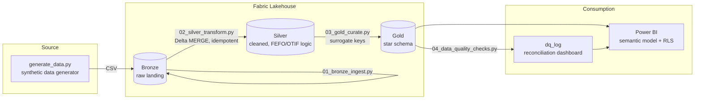

# Supply Chain Control Tower

[](https://github.com/KushPatel29/supply-chain-control-tower-/actions/workflows/ci.yml)


A Microsoft Fabric + Power BI analytics platform for a synthetic perishable-goods
distributor — inventory turns, days-on-hand, OTIF/fill rate, and FEFO/expiry risk,
built on a governed Lakehouse medallion architecture with row-level security.
Every push regenerates the data and runs a 13-test suite over the pipeline's
business logic, so the badge above means the whole thing actually works.

This project reproduces (with synthetic data, since the original is confidential
employer data) the same architecture and KPI suite I built in production for a
specialty foods distributor: Bronze → Silver → Gold Lakehouse layers, PySpark
transformations, a star-schema semantic model, automated data quality checks,
and a Power BI report with RLS.

## Dashboard

Three-page Power BI report, hand-authored as a Power BI Project (TMDL semantic
model + PBIR report definition) in [`powerbi/pbip/`](powerbi/pbip/) — open
`SupplyChainControlTower.pbip` in Power BI Desktop and hit Refresh.

**Executive Overview** — revenue, margin, OTIF and expiry risk at a glance:


**Inventory & Expiry Risk** — FEFO risk banding, value by warehouse, lot-level traceability:


**Fulfillment (OTIF)** — OTIF/fill-rate trend, by channel and region, customer scorecard:


## Why this project

Food/perishable supply chains need inventory visibility that goes beyond "units
on hand" — a pallet expiring in 2 days is a different problem than the same
quantity with 90 days of shelf life left. This project builds a KPI suite and
data pipeline that treats expiry risk as a first-class metric, alongside the
standard revenue/margin/fulfillment numbers finance and ops both need.

## Architecture



## Tech stack

Microsoft Fabric (Lakehouse, PySpark notebooks), Power BI (DAX, star-schema
semantic modeling, RLS, Tabular Editor for object-level security), T-SQL
(Fabric Warehouse DDL), Python (pandas, Faker for synthetic data).

## Repo layout

```
data_generator/     synthetic data generator (Python)
data/bronze/        generated raw CSVs (sample output, ~30k rows total)
notebooks/          PySpark notebooks: 01 bronze ingest -> 02 silver transform
                     -> 03 gold curate -> 04 data quality checks
sql/                T-SQL DDL for the Gold star schema
powerbi/            DAX measure library, build guide (incl. RLS/OLS), and the
                     ready-to-open PBIP project (TMDL model + PBIR report)
docs/               metric dictionary (governed KPIs) + pipeline orchestration spec
tests/              pytest suite: referential integrity, FEFO/OTIF/margin rules
.github/workflows/  CI — regenerates data and runs the test suite on every push
```

## How to reproduce

1. **Generate the data**
   ```bash
   cd data_generator
   pip install -r requirements.txt
   python generate_data.py
   ```
   Writes ~30k rows across 7 CSVs to `data/bronze/`.

2. **Stand up Fabric** (free 60-day trial at [app.fabric.microsoft.com](https://app.fabric.microsoft.com)) — create a workspace, a Lakehouse, upload the CSVs from `data/bronze/` to `Files/bronze/`, then attach a notebook and run `notebooks/01_bronze_ingest.py` through `04_data_quality_checks.py` in order (copy each `# %%` cell into a Fabric notebook cell). To productionize the schedule, build the Data Pipeline described in [`docs/fabric_pipeline_spec.md`](docs/fabric_pipeline_spec.md) — DQ failures gate the semantic-model refresh and alert on the failure edge.

3. **Build the Power BI report** — follow [`powerbi/BUILD_GUIDE.md`](powerbi/BUILD_GUIDE.md) for the semantic model, DAX measures, RLS, and object-level security setup.

## KPI suite

| KPI | Definition | Where |
|---|---|---|
| OTIF % | Shipped on/before promised date AND fill rate ≥ 95% | `fact_orders` |
| Inventory Turns | Annualized COGS / average inventory value | `fact_inventory` |
| Days on Hand | 365 / Inventory Turns | `fact_inventory` |
| Expiry Risk | Critical (≤2 days), Warning (≤5 days), OK — computed in Silver from lot expiry dates | `fact_inventory` |
| Gross Margin % | (Revenue − COGS) / Revenue | `fact_orders` |

## Data quality & governance

`04_data_quality_checks.py` runs completeness, uniqueness, referential
integrity, and control-total reconciliation checks after every Gold build and
logs results to `gold.dq_log` — the same automated reconciliation pattern used
in production to catch discrepancies before they reach an executive dashboard.

Every metric exposed to report consumers is defined in
[`docs/metric_dictionary.md`](docs/metric_dictionary.md) with formula, grain,
owner, and refresh SLA — definitions change only via PR, in the same commit
as the implementation change, so the dictionary and the DAX never drift apart.

## Testing & CI

`tests/test_pipeline_logic.py` independently re-implements the Silver-layer
business rules (FEFO risk banding, OTIF, margin) in pandas and asserts they
hold for every generated row, alongside referential-integrity and uniqueness
invariants. GitHub Actions regenerates the dataset from scratch and runs the
suite on every push:

```bash
pip install pytest
pytest tests/ -v    # 13 tests
```

## Not just food: adapting this to other industries

FEFO/expiry logic is just "time-bounded inventory urgency" — the same
architecture drops into any industry where stock has a clock or a trace
requirement:

| Industry | What "lot + expiry" becomes | What OTIF becomes |
|---|---|---|
| Pharma / medical devices | Batch + expiration, FDA lot traceability | Order fill compliance |
| Retail / e-commerce | Seasonal SKU + markdown date | Promised-delivery-date hit rate |
| Manufacturing | Production batch + warranty window | On-time production order completion |
| Chemicals | Batch + stability/retest date | Delivery reliability |
| Logistics / 3PL | Shipment + SLA deadline | SLA attainment |

Concretely: rename `dim_lot`, repoint the expiry thresholds in
`02_silver_transform.py`, and the rest of the pipeline — medallion layers,
star schema, DQ checks, RLS — carries over unchanged.

## Notes on the synthetic data

All data is generated by `data_generator/generate_data.py` using Faker and
numpy — no real company, customer, or product data is used anywhere in this
repo.
