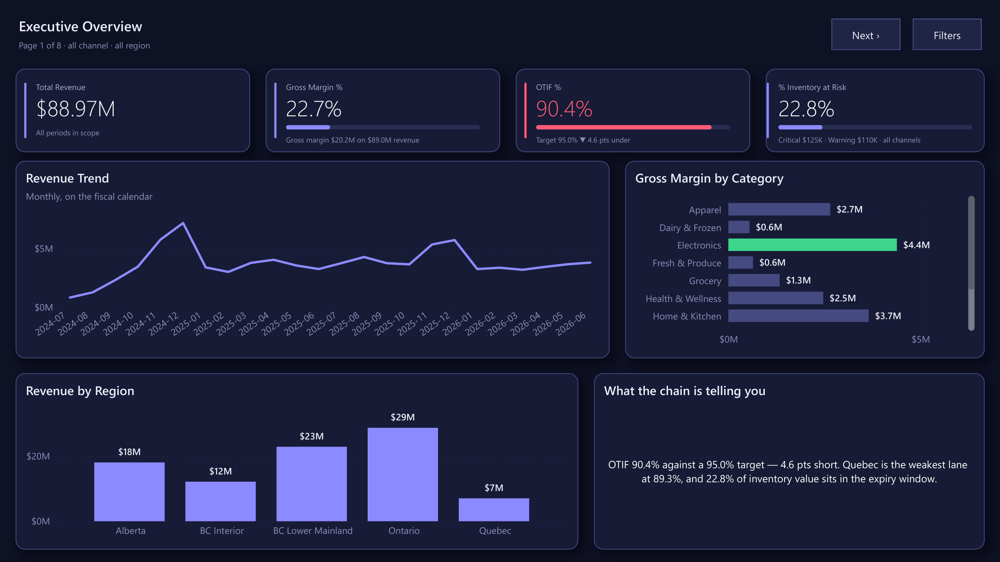
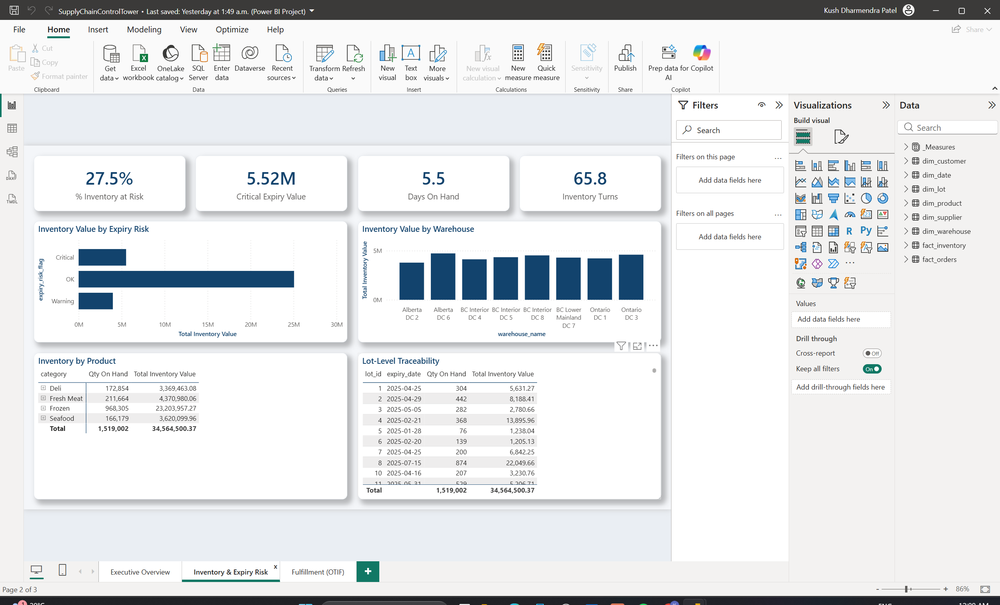
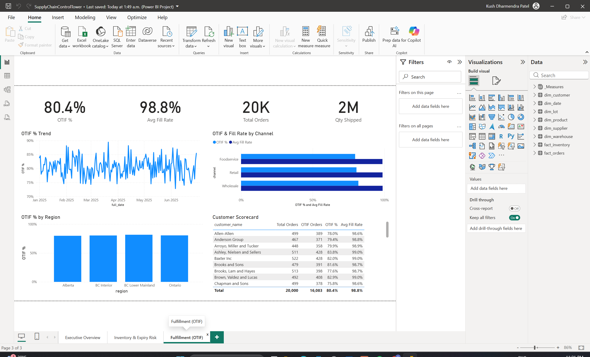
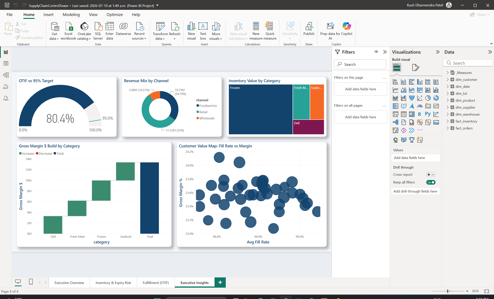
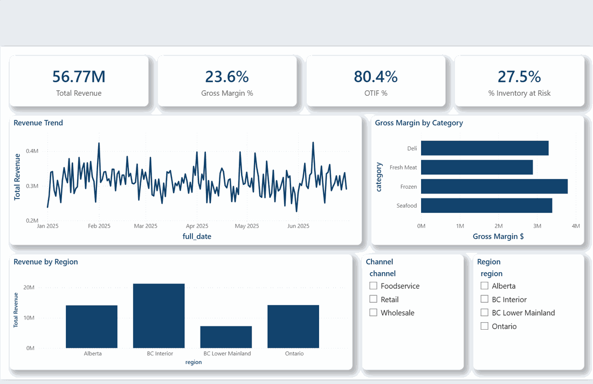
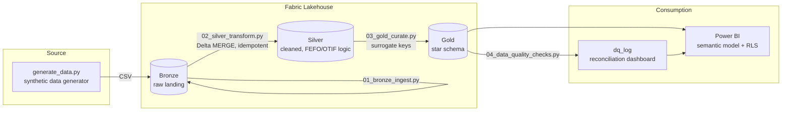
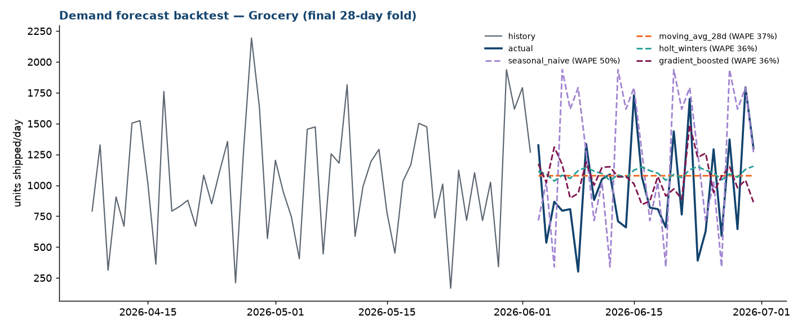

# Supply Chain Control Tower

[](https://github.com/KushPatel29/supply-chain-control-tower-/actions/workflows/ci.yml)


In specialty food distribution, every pallet is a countdown timer. A case of
striploin with 90 days of shelf life is inventory; the same case with 3 days
left is a problem, and next week it's a write-off. I spent years building
analytics for exactly this business, and this repo is that work rebuilt in
the open — Microsoft Fabric medallion pipeline, star-schema semantic model,
a Power BI control tower with row-level security — on synthetic data,
because the original belongs to a former employer.

One rule governs everything here: **nothing is claimed that isn't run,
tested, or measured.** Every push regenerates the data from scratch,
executes the whole pipeline through a data-quality gate that provably blocks
bad builds, and runs a 22-test suite. The green badge above covers the
failure paths too.

## The problem, in one walk through the warehouse

Picture the Monday questions at a perishables distributor. Ops wants to
know what expires this week and in which DC. Sales wants to know whether we
shipped Friday's orders complete and on time, because the OTIF penalty
clause in the grocery contract says 95% or we pay. Finance wants margin by
category and doesn't care about the first two questions until suddenly,
during an expiry write-off, they care very much.

A stock report answers none of this. "Units on hand" treats the 3-day
striploin and the 90-day striploin as the same number. So the pipeline here
treats urgency as data: every inventory row carries a `days_until_expiry`
and a FEFO risk band (**Critical ≤ 2 days, Warning ≤ 5**), computed once in
the Silver layer and inherited by everything downstream — no analyst
re-deriving expiry logic in a report ever again.

The KPI suite is the one both ops and finance sign off on:

| KPI | Definition | Where |
|---|---|---|
| OTIF % | Shipped on/before promised date AND fill rate ≥ 95% | `fact_orders` |
| Inventory Turns | Annualized COGS / average inventory value | `fact_inventory` |
| Days on Hand | 365 / Inventory Turns | `fact_inventory` |
| Expiry Risk | Critical (≤2 days), Warning (≤5 days), OK | `fact_inventory` |
| Gross Margin % | (Revenue − COGS) / Revenue | `fact_orders` |

Each definition lives in [`docs/metric_dictionary.md`](docs/metric_dictionary.md)
with its formula, grain, owner, and refresh SLA, and only changes via PR in
the same commit as the code — because the fastest way to lose an executive's
trust is two dashboards disagreeing on what "OTIF" means.

## The control tower itself

Four report pages, hand-authored as a Power BI Project (TMDL semantic model
+ PBIR definition) in [`powerbi/pbip/`](powerbi/pbip/) — open
`SupplyChainControlTower.pbip` in Desktop and hit Refresh.

**Executive Overview** — revenue, margin, OTIF and expiry risk on one screen:



**Inventory & Expiry Risk** — FEFO banding, value at risk by warehouse, and
lot-level traceability (the "which customers got batch X" question, answered
in seconds):



**Fulfillment (OTIF)** — the trend, the by-channel cut, and a customer
scorecard for the quarterly review:



**Executive Insights** — OTIF gauge against target, margin waterfall,
a customer value map, the inventory treemap:



And it's live — every slicer cross-filters every visual:



## How the data flows

Classic medallion, for a practical reason: **Bronze keeps the receipts**
(raw landings, untouched, so you can always replay), **Silver is where the
business rules live** (dedup, referential checks, and the FEFO/OTIF/margin
logic — computed exactly once), and **Gold is the star schema** — the only
layer Power BI is ever allowed to touch.



The Silver loads use Delta `MERGE` keyed on natural keys, so re-running a
notebook never duplicates a row — boring by design, which is the highest
compliment you can pay a pipeline.

Stack: Microsoft Fabric (Lakehouse, PySpark), Power BI (DAX, TMDL, RLS/OLS,
calculation groups), T-SQL for the Gold DDL, Python for everything that
proves the rest works.

## The pipeline that refuses to publish

Here's the incident this design exists to prevent: a source system hiccups,
a dimension picks up a duplicate key, every fact row joins twice, and
revenue silently doubles on the Monday executive dashboard. Nobody notices
until the CFO does. The fix isn't better dashboards — it's a pipeline that
**won't publish a broken build.**

[`pipeline/run_pipeline.py`](pipeline/run_pipeline.py) runs the same stage
graph as the Fabric spec, entirely locally: bronze → silver → gold → then
**20 data-quality checks** (completeness, key uniqueness, referential
integrity, a silver-to-gold control-total reconciliation), each tagged
critical or warning. One critical failure and the run halts, revokes the
publish marker so downstream never reads the bad build, and exits non-zero
— the exit code a Fabric If-Condition (or any scheduler) turns into a
blocked refresh and an alert.

And because a gate you've never seen close is just decoration, CI sabotages
the build on every push — injects a duplicate key, and fails the workflow
unless the gate trips:

```bash
python pipeline/run_pipeline.py                     # bronze -> silver -> gold -> DQ -> publish
python pipeline/run_pipeline.py --inject-dq-failure # watch it refuse: exit code 2, no publish
pytest tests/ -v                                    # 22 tests, incl. 4 on the gate itself
```

## The forecast bake-off (in which the fancy model loses)

Demand planning needs a number for next month's order book, and everyone
has a favorite model. So instead of picking one, `analytics/demand_forecast.py`
makes four of them fight: rolling-origin backtesting, 4 folds, 28-day
horizon, scored on WAPE — the evaluation a demand planner would actually
accept, not one lucky train/test split.

| Model | Avg WAPE (lower is better) |
|---|---|
| **Moving average (28d)** | **18.5%** ← shipped |
| Gradient-boosted trees (lag + calendar features) | 19.6% |
| Holt-Winters (weekly seasonality) | 19.7% |
| Seasonal naive (the baseline to beat) | 24.3% |

I'll be honest: the boosted-tree challenger was supposed to win. It didn't.
On stable weekly demand, a 28-day moving average beats it, and the backtest
is what earns the right to ship the boring model. The test suite pins the
evaluation itself — no training leakage, full horizon coverage, and the
house rule: *beat the naive baseline or we ship the baseline.*



Every run logs params and metrics per model to **MLflow**
(`mlflow ui --backend-store-uri sqlite:///mlflow.db`), so the bake-off has
an auditable history instead of a folklore of "we tried that once."

## Security that lives in a table, not in code

"Give the new BC manager dashboard access" should be a data edit, not a
model deployment. The semantic model ships three roles (all in TMDL, all in
git):

- **Regional Manager — dynamic RLS.** Entitlements sit in a hidden
  `security_mapping` table (UPN → region). The role filter —
  `dim_warehouse[region] IN CALCULATETABLE(VALUES(security_mapping[region]),
  security_mapping[upn] = USERPRINCIPALNAME())` — means a manager mapped to
  two regions sees both, and onboarding someone is one row. Verified live by
  DAX impersonation: the mapped principal sees exactly 4 of 8 DCs.
- **Field Ops — object-level security.** For this role `dim_supplier`
  doesn't filter to nothing; it *ceases to exist* (`metadataPermission:
  none` — queries can't even resolve the table name). Supplier commercial
  terms are on a need-to-know basis; the rest of the model works untouched.
- **Sales - BC Lower Mainland** — the static single-territory contrast case.

Time intelligence got the same "define it once" treatment: a
**calculation group** (Current / MTD / QTD / YTD / Previous Month / MoM % /
Rolling 28D) applies period logic to *every* measure — 7 calculation items
where the naive approach writes 19 measures × 7 variants and then maintains
133 of them forever.

While I was in the model with a profiler, I found something better than
what I was looking for: Power BI's auto date/time feature had quietly
attached a hidden calendar table to every date column, and those hidden
tables were **90.5% of the model's column storage**. The model already has
a proper `dim_date`. They're gone now — measurement, surgery, and the
before/after are written up in
[`docs/MODEL_OPTIMIZATION.md`](docs/MODEL_OPTIMIZATION.md).

## Does it scale? I stopped claiming and measured

The demo dataset is ~30k rows so the repo runs anywhere in seconds. The
design, though, is the 100M-row design — and [`benchmarks/`](benchmarks/BENCHMARKS.md)
puts numbers behind that instead of adjectives. A 10-million-row fact table
through Delta Lake, on a laptop:

- Incremental `MERGE` of a daily 50k-row delta: **0.5s**, vs 1.9s to reload
  the table — and the merge is idempotent and keeps history.
- `OPTIMIZE Z-ORDER BY (date_key, product_key)`: a one-day point query goes
  from touching **20 of 20 files to 1 of 20** — 95% file skipping, read
  straight from the transaction log's min/max stats, not inferred from
  timings.
- The honest caveat is in the write-up too: on local NVMe at 10M rows even
  a full rewrite is cheap. The *pattern* is what scales; the file-skipping
  ratio is the number that gets more valuable with size.

At 100M+ rows the playbook is: monthly partitions with incremental refresh
on the two trailing partitions, an in-model aggregation table for trend
visuals with drillthrough to detail, and — the actual point of building it
governed from day one — the star schema, measures, RLS, and every test stay
exactly as they are.

## Run it yourself

```bash
# 1. generate the data (~30k rows across 7 CSVs)
cd data_generator && pip install -r requirements.txt && python generate_data.py && cd ..

# 2. run the whole medallion locally — no Fabric account needed
python pipeline/run_pipeline.py

# 3. open powerbi/pbip/SupplyChainControlTower.pbip in Power BI Desktop, hit Refresh
```

To run it on real Fabric: free trial at
[app.fabric.microsoft.com](https://app.fabric.microsoft.com), upload
`data/bronze/` to a Lakehouse, run `notebooks/01…04` in order, and wire the
schedule per [`docs/fabric_pipeline_spec.md`](docs/fabric_pipeline_spec.md)
— the DQ output gates the semantic-model refresh exactly like the local
runner does. The Power BI build steps are in
[`powerbi/BUILD_GUIDE.md`](powerbi/BUILD_GUIDE.md).

> **What I didn't fake:** Fabric deployment pipelines (Dev→Test→Prod) and
> Fabric Git integration need a working service login, which this machine
> doesn't currently have. Rather than paste unverifiable screenshots, this
> repo ships the runnable local equivalent (the gated orchestrator above)
> and the pipeline-as-spec. Everything you *can* see here, you can run.

## It's not really about food

FEFO is just "inventory with a clock," which is most inventory:

| Industry | What "lot + expiry" becomes | What OTIF becomes |
|---|---|---|
| Pharma / medical devices | Batch + expiration, FDA lot traceability | Order fill compliance |
| Retail / e-commerce | Seasonal SKU + markdown date | Promised-delivery-date hit rate |
| Manufacturing | Production batch + warranty window | On-time production order completion |
| Chemicals | Batch + stability/retest date | Delivery reliability |
| Logistics / 3PL | Shipment + SLA deadline | SLA attainment |

The pharma version is barely a rename: `dim_lot` becomes the batch record
(lot, NDC, expiration), FEFO bands become expiry-pull windows, lot
drillthrough becomes the recall-response query, and the RLS design maps to
territory compliance. Swap the thresholds in `02_silver_transform.py` and
the medallion, star schema, DQ gate, and security all carry over unchanged.

## Repo map

```
data_generator/     synthetic data generator (Faker + numpy, fixed seed)
data/bronze/        generated raw CSVs (~30k rows)
pipeline/           run_pipeline.py — local medallion orchestrator + DQ gate
notebooks/          PySpark notebooks: 01 bronze -> 02 silver -> 03 gold -> 04 DQ
analytics/          demand_forecast.py — 4-model rolling-origin backtest + MLflow
benchmarks/         10M-row Delta Lake benchmarks (MERGE, Z-order file skipping)
sql/                T-SQL DDL for the Gold star schema
powerbi/            PBIP project (TMDL + PBIR): dynamic RLS + OLS roles,
                     Time Intelligence calculation group, DAX library, build guide
docs/               metric dictionary, pipeline spec, MODEL_OPTIMIZATION.md
tests/              22 tests: pipeline gate, FEFO/OTIF/margin rules, forecast design
.github/workflows/  CI — full pipeline + DQ-gate sabotage proof + test suite
```

One last thing, since it matters: every number, customer, and product in
this repo comes out of `data_generator/generate_data.py`. The data is fake.
The engineering is not.
