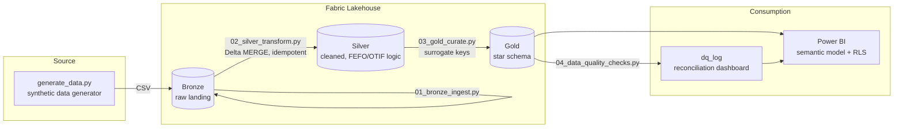

# Supply Chain Control Tower

A Microsoft Fabric + Power BI analytics platform for a synthetic perishable-goods
distributor — inventory turns, days-on-hand, OTIF/fill rate, and FEFO/expiry risk,
built on a governed Lakehouse medallion architecture with row-level security.

This project reproduces (with synthetic data, since the original is confidential
employer data) the same architecture and KPI suite I built in production for a
specialty foods distributor: Bronze → Silver → Gold Lakehouse layers, PySpark
transformations, a star-schema semantic model, automated data quality checks,
and a Power BI report with RLS.

## Why this project

Food/perishable supply chains need inventory visibility that goes beyond "units
on hand" — a pallet expiring in 2 days is a different problem than the same
quantity with 90 days of shelf life left. This project builds a KPI suite and
data pipeline that treats expiry risk as a first-class metric, alongside the
standard revenue/margin/fulfillment numbers finance and ops both need.

## Architecture



## Tech stack

Microsoft Fabric (Lakehouse, PySpark notebooks), Power BI (DAX, star-schema
semantic modeling, RLS, Tabular Editor for object-level security), T-SQL
(Fabric Warehouse DDL), Python (pandas, Faker for synthetic data).

## Repo layout

```
data_generator/     synthetic data generator (Python)
data/bronze/        generated raw CSVs (sample output, ~30k rows total)
notebooks/          PySpark notebooks: 01 bronze ingest -> 02 silver transform
                     -> 03 gold curate -> 04 data quality checks
sql/                T-SQL DDL for the Gold star schema
powerbi/            DAX measure library + Power BI build guide (incl. RLS/OLS)
```

## How to reproduce

1. **Generate the data**
   ```bash
   cd data_generator
   pip install -r requirements.txt
   python generate_data.py
   ```
   Writes ~30k rows across 7 CSVs to `data/bronze/`.

2. **Stand up Fabric** (free 60-day trial at [app.fabric.microsoft.com](https://app.fabric.microsoft.com)) — create a workspace, a Lakehouse, upload the CSVs from `data/bronze/` to `Files/bronze/`, then attach a notebook and run `notebooks/01_bronze_ingest.py` through `04_data_quality_checks.py` in order (copy each `# %%` cell into a Fabric notebook cell).

3. **Build the Power BI report** — follow [`powerbi/BUILD_GUIDE.md`](powerbi/BUILD_GUIDE.md) for the semantic model, DAX measures, RLS, and object-level security setup.

## KPI suite

| KPI | Definition | Where |
|---|---|---|
| OTIF % | Shipped on/before promised date AND fill rate ≥ 95% | `fact_orders` |
| Inventory Turns | Annualized COGS / average inventory value | `fact_inventory` |
| Days on Hand | 365 / Inventory Turns | `fact_inventory` |
| Expiry Risk | Critical (≤2 days), Warning (≤5 days), OK — computed in Silver from lot expiry dates | `fact_inventory` |
| Gross Margin % | (Revenue − COGS) / Revenue | `fact_orders` |

## Data quality & governance

`04_data_quality_checks.py` runs completeness, uniqueness, referential
integrity, and control-total reconciliation checks after every Gold build and
logs results to `gold.dq_log` — the same automated reconciliation pattern used
in production to catch discrepancies before they reach an executive dashboard.

## Notes on the synthetic data

All data is generated by `data_generator/generate_data.py` using Faker and
numpy — no real company, customer, or product data is used anywhere in this
repo.
