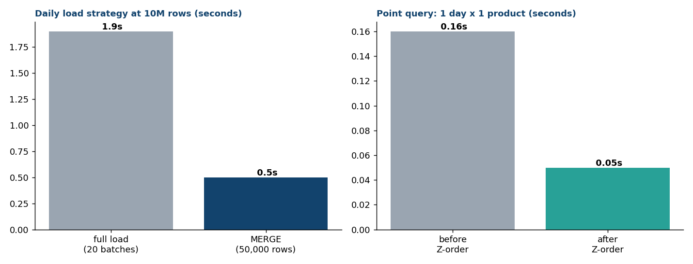

# Scale benchmarks — proving the design at 10M rows

The README's scale section claims the medallion design holds beyond the
30k-row demo dataset. This directory measures it instead of asserting it:
[`scale_benchmark.py`](scale_benchmark.py) builds a **10,000,000-row**
`fact_orders`-shaped table and runs it through Delta Lake (delta-rs) on a
local machine. Reproduce with:

```bash
pip install deltalake pyarrow
python benchmarks/scale_benchmark.py --rows 10000000
```

## Results (10M rows, local NVMe, delta-rs 1.x)

| Operation | Result |
|---|---|
| Initial load, 20 batched appends | **1.9 s** |
| Incremental `MERGE` of a 50k-row daily delta | **0.5 s** (~4x cheaper than reloading) |
| `OPTIMIZE Z-ORDER BY (date_key, product_key)` | 5.4 s one-time |
| Point query (1 day x 1 product) before Z-order | 0.16 s — **20/20 files** are candidates |
| Same query after Z-order | **0.05 s — 1/20 files** is a candidate (95% skipped) |



## What the numbers teach

- **File skipping is a data-layout property, not a query-engine trick.** A
  table loaded in arrival order spreads every date across every file, so the
  engine must consider all 20 files for a single-day query (min/max stats
  bracket everything). Z-ordering on `(date_key, product_key)` co-locates
  rows so the same stats eliminate 19 of 20 files — measured directly from
  the Delta transaction log's per-file min/max, not inferred from timings.
- **MERGE pays off when the delta is small relative to the table.** The 50k
  daily upsert lands in 0.5 s vs 1.9 s to reload — and unlike a reload, it's
  idempotent and preserves table history (time travel). This is the same
  `whenMatchedUpdateAll / whenNotMatchedInsertAll` pattern notebook
  `02_silver_transform.py` uses in Fabric.
- **Honest caveat:** on local NVMe at 10M rows, even a full rewrite is cheap
  (1.0–1.9 s) — rewrite bandwidth only becomes the constraint on cloud
  object storage and at 100M+ rows. The pattern is what scales, and the
  file-skipping ratio (95% here) is the number that grows more valuable
  with size.
