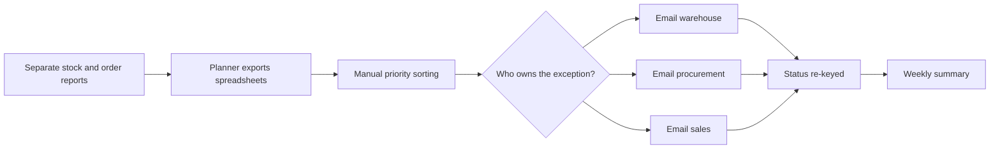
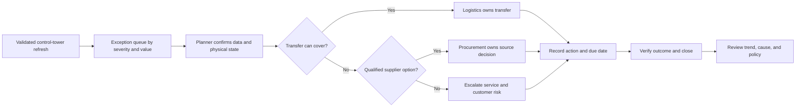

# Inventory and Supplier Exception Process

**Owner:** Operations planning

**Review cadence:** Quarterly and after a material service failure
**Evidence boundary:** This process case is reconstructed from the synthetic
control-tower project and the operational problems it models. It demonstrates
business-analysis method and does not claim a municipal or client deployment.

## Purpose

Turn inventory, expiry, supplier, and fulfilment exceptions into owned actions
before they become a stock-out, write-off, service penalty, or unplanned
purchase. The Power BI control tower is the decision surface; this document
defines the human process around it.

## Scope

Included: daily exception review, severity, ownership, transfer-versus-buy
decision, supplier escalation, closure, and metric review.

Excluded: purchase-order approval authority, contract changes, physical recall
execution, and the underlying warehouse transactions.

## Stakeholders

- Operations planning owns the daily exception queue.
- Warehouse operations confirms physical stock, lot, and condition.
- Procurement owns supplier and purchase actions.
- Logistics owns transfer feasibility and transport execution.
- Sales or customer service owns customer commitments.
- Finance is consulted on working-capital and write-off exposure.
- Data or BI support owns source, metric, and refresh incidents.

## Current State

### Problems

- A national stock total can hide shortages and surpluses at different sites.
- Days of cover without lead time can misclassify a long-lane risk.
- Shortfalls and surpluses are netted even when they concern different SKUs or
  locations.
- Supplier tiers describe the contract, not measured performance.
- Ownership, closure evidence, and repeated exceptions are difficult to trace.

## Future State

## RACI

| Step | Operations planning | Warehouse | Procurement | Logistics | Sales | Finance | BI support |
|---|---|---|---|---|---|---|---|
| Review and prioritise queue | A/R | C | C | C | I | I | C |
| Confirm stock, lot, and condition | C | A/R | I | I | I | I | C |
| Decide transfer versus purchase | A | C | R | R | C | C | I |
| Approve supplier action | C | I | A/R | I | I | C | I |
| Communicate customer impact | C | I | I | C | A/R | I | I |
| Resolve data-quality exception | C | C | I | I | I | I | A/R |
| Verify outcome and close | A/R | C | C | C | C | I | I |
| Review policy and KPI trend | A/R | C | C | C | C | C | C |

## Requirements

| ID | Requirement | Acceptance condition |
|---|---|---|
| BR-01 | Each exception has one owner, severity, due date, action, and status. | No open critical exception lacks an owner or due date. |
| BR-02 | Shortages and surpluses remain visible by SKU and location. | Aggregation cannot cancel unlike positions. |
| BR-03 | Transfer feasibility is evaluated before a new purchase. | Queue records the transfer decision and reason. |
| BR-04 | Supplier performance is measured against published targets, not relative ranking. | Scorecard retains target, measured value, and contractual tier separately. |
| BR-05 | Users can identify the source and refresh status behind an exception. | Every queue record links to run and data-quality status. |
| BR-06 | A data-quality failure blocks publication or is visibly quarantined. | Injected critical failures do not publish a healthy status. |
| BR-07 | Users can review the spatial relationship between governed nodes. | GIS layers reconcile to supplier and warehouse keys, validate WGS 84 coordinates, and label screening-distance limitations. |

## Detailed Process

1. **Open the validated queue.** Confirm refresh time and the data-quality
   verdict before making an operational decision.
2. **Triage by consequence.** Consider service exposure, days until expiry,
   lane lead time, value at risk, and customer commitment.
3. **Confirm the physical state.** Warehouse staff validate quantity, lot,
   condition, and any transaction timing issue.
4. **Choose the least disruptive response.** Check an internal transfer before
   purchase, then qualified supplier alternatives before escalation.
5. **Assign and communicate.** Record one accountable owner, due date, chosen
   action, affected customer or service, and escalation threshold.
6. **Verify and close.** Confirm the stock position or service outcome changed;
   closure is evidence, not a status update alone.
7. **Improve the process.** Review repeated causes, supplier measures, policy
   thresholds, and data defects each quarter.

## Exceptions

| Scenario | Response |
|---|---|
| Source data fails a critical quality rule | Block the refresh, publish the failure, and use the last approved snapshot with a visible timestamp. |
| Physical stock disagrees with the system | Open a cycle-count exception; do not solve it with a planning parameter change. |
| No qualified alternate supplier exists | Escalate service risk and lead time; do not treat an unqualified source as available capacity. |
| Transfer solves quantity but misses the customer deadline | Evaluate against the service date, not inventory quantity alone. |
| KPI definition is disputed | Return to the metric owner and dictionary; do not recalculate the meeting's preferred answer. |

## Measures

| Metric | Target or direction | Purpose |
|---|---|---|
| Critical exceptions without owner | 0 | Accountability |
| Time from alert to accepted action | Downward trend | Decision speed |
| Shortfall value covered by transfer | Measured, not pre-targeted | Avoid unnecessary purchase |
| Expiry value written off | Downward trend | Waste and working capital |
| OTIF split by late-only and short-only | Report both | Corrective-action clarity |
| Repeat data-quality exceptions | Downward trend | Sustainable process improvement |
| Long-distance exception actions reviewed with spatial context | Increasing coverage | Reduce decisions made from tabular distance assumptions alone |

## Change and Adoption

- Pilot the queue with one warehouse and one planning team.
- Compare old and new priority lists and discuss every material difference.
- Train by role: planners decide, warehouse staff verify, procurement sources,
  and BI support resolves data defects.
- Publish decision rules and escalation thresholds beside the queue.
- Review adoption through owner completeness, response time, repeated manual
  spreadsheets, and support contacts.
- Keep the prior report available during a defined transition window, with a
  named retirement decision.

## Transferable Pattern for Municipal Asset Management

This is not municipal experience, but the analysis pattern transfers cleanly:

| Operational inventory pattern | Municipal asset-management analogue |
|---|---|
| SKU and location master | Asset register and location or GIS reference |
| Expiry or shortage severity | Condition, criticality, and service consequence |
| Transfer-versus-buy decision | Repair, redeploy, replace, or defer decision |
| Supplier scorecard | Contractor or vendor service performance |
| Exception queue | Inspection defect or maintenance backlog |
| ERP, WMS, and reporting integration | Finance, work management, GIS, and reporting integration |

The transferable capability is requirements, workflow analysis, data quality,
ownership, prioritisation, and measured service improvement. The domain rules
would need to be learned with municipal asset owners rather than assumed.

## Related Documents

- [Metric dictionary](metric_dictionary.md)
- [Fabric pipeline specification](fabric_pipeline_spec.md)
- [Deployment guide](DEPLOYMENT.md)
- [GIS network analysis](gis_network_analysis.md)
